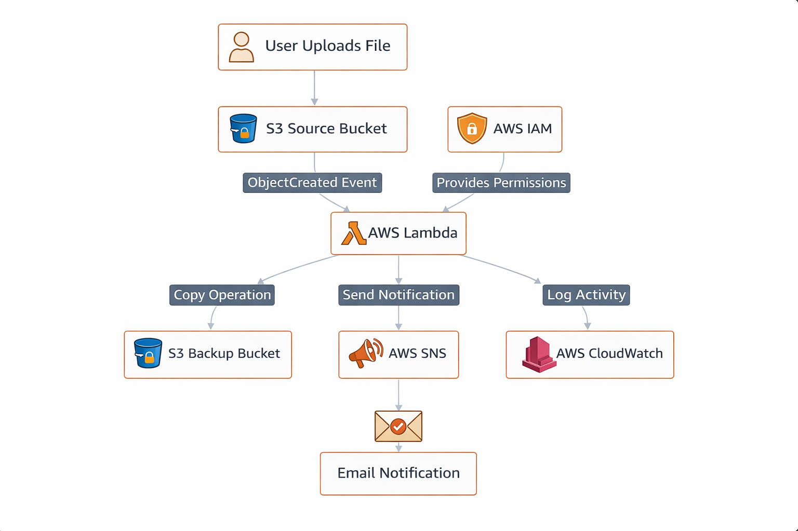
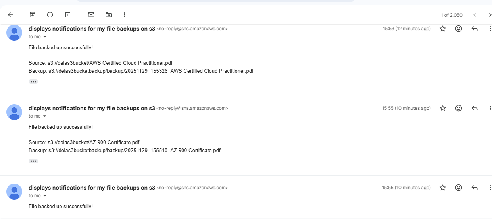
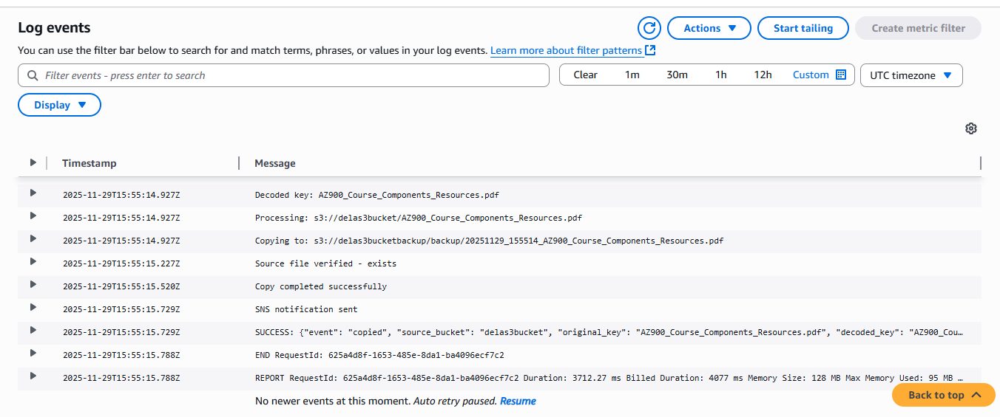
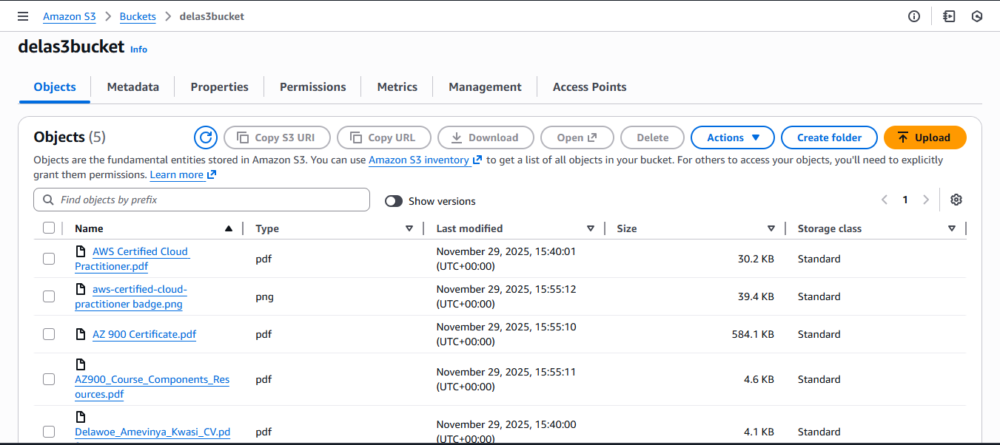
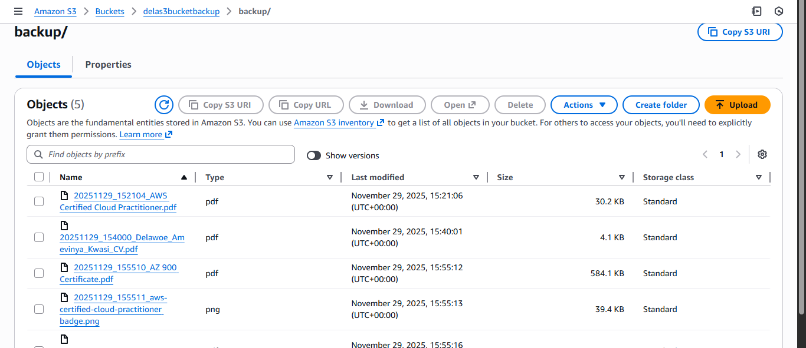

# 📦 AWS Personal File Backup System

An **event-driven personal file backup system** built on AWS that automatically copies files from a source S3 bucket to a backup bucket and sends email notifications upon success.

---

## 🏗️ Architecture

**Workflow:**
1. User uploads file to S3 source bucket  
2. S3 triggers AWS Lambda  
3. Lambda copies file to backup bucket  
4. SNS sends email notification  
5. CloudWatch logs all activity  

---

## 🚀 Features

-Automated file backup triggered on every upload
-Timestamped filenames to prevent overwrites
-Email notifications via SNS on successful backup
-Comprehensive CloudWatch logging for all operations
-Secure IAM configuration with least-privilege access
-Encryption enabled on both S3 buckets
-Public access blocked by default

---

## 📂 Project Structure
AWS-Personal-File-Backup-System/
├── lambda_function.py
├── iam-policy.json
├── README.md
└── Screenshots/
├── file backup architecture.png
├── main s3 bucket.png
├── s3 backup screenshot.png
├── Email Notification.png
└── Log events.png

---
## ⚙️ Lambda Function (Core Logic)
import boto3
import urllib.parse
import logging
from datetime import datetime

logger = logging.getLogger()
logger.setLevel(logging.INFO)

s3 = boto3.client('s3')
sns = boto3.client('sns')

BACKUP_BUCKET = 'your-backup-bucket-name'
SNS_TOPIC_ARN = 'arn:aws:sns:your-region:your-account-id:your-topic-name'

def lambda_handler(event, context):
    # Extract source bucket and file key from the S3 event
    source_bucket = event['Records'][0]['s3']['bucket']['name']
    file_key = urllib.parse.unquote_plus(
        event['Records'][0]['s3']['object']['key']
    )

    # Generate a timestamped backup filename to prevent overwrites
    timestamp = datetime.now().strftime('%Y%m%d_%H%M%S')
    backup_key = f"backup_{timestamp}_{file_key}"

    try:
        # Copy file from source to backup bucket
        s3.copy_object(
            CopySource={'Bucket': source_bucket, 'Key': file_key},
            Bucket=BACKUP_BUCKET,
            Key=backup_key
        )
        logger.info(f"Successfully backed up {file_key} to {BACKUP_BUCKET}/{backup_key}")

        # Send SNS email notification
        sns.publish(
            TopicArn=SNS_TOPIC_ARN,
            Subject='File Backup Successful',
            Message=(
                f"File backup completed successfully.\n\n"
                f"Original File: s3://{source_bucket}/{file_key}\n"
                f"Backup Location: s3://{BACKUP_BUCKET}/{backup_key}\n"
                f"Timestamp: {timestamp}"
            )
        )

        return {'statusCode': 200, 'body': 'Backup successful'}

    except Exception as e:
        logger.error(f"Backup failed for {file_key}: {str(e)}")
        raise
        
🛠️ Setup Instructions

Prerequisites

-AWS account (free tier is sufficient)
-AWS CLI installed and configured
-Basic familiarity with the AWS Console

1️⃣ Create S3 Buckets
Create two buckets: one as the source and one as the backup.
aws s3api create-bucket --bucket your-source-bucket --region us-east-1
aws s3api create-bucket --bucket your-backup-bucket --region us-east-1

For both buckets, enable the following in the AWS Console under bucket settings:

Block all public access — ON
Server-side encryption (SSE-S3) — Enabled

2️⃣ Create SNS Topic

aws sns create-topic --name FileBackupNotifications

Subscribe your email address:

aws sns subscribe 

  -topic-arn arn:aws:sns:us-east-1:YOUR_ACCOUNT_ID:FileBackupNotifications
  -protocol email 
  -notification-endpoint your@email.com
  
Check your inbox and confirm the subscription.

3️⃣Create IAM Role for Lambda
In the AWS Console, create a new IAM role with Lambda as the trusted entity and attach these permissions:

AWSLambdaBasicExecutionRole (AWS managed)

Custom inline policy for S3 and SNS:

{
  "Version": "2012-10-17",
  "Statement": [
    {
      "Effect": "Allow",
      "Action": ["s3:GetObject"],
      "Resource": "arn:aws:s3:::your-source-bucket/*"
    },
    {
      "Effect": "Allow",
      "Action": ["s3:PutObject"],
      "Resource": "arn:aws:s3:::your-backup-bucket/*"
    },
    {
      "Effect": "Allow",
      "Action": ["sns:Publish"],
      "Resource": "arn:aws:sns:us-east-1:YOUR_ACCOUNT_ID:FileBackupNotifications"
    }
  ]
}

4️⃣ Create Lambda Function

In the AWS Console:
-Go to Lambda → Create function
-Runtime: Python 3.12
-Attach the IAM role created in Step 3
-Set timeout to 30 seconds (default 3s is insufficient for S3 operations)
-Paste the Lambda code above
-Update BACKUP_BUCKET and SNS_TOPIC_ARN with your actual values

5️⃣  Configure S3 Event Trigger
In the AWS Console:

Go to your source S3 bucket → Properties → Event notifications
Create a new notification with the following settings:

Event type: s3:ObjectCreated:*
Destination: Lambda function → select your function 

6️⃣ Test the System
Upload a test file to your source bucket:
aws s3 cp testfile.txt s3://your-source-bucket/
Then verify each component worked:

The file appears in your backup bucket with a timestamp prefix
You receive an email notification
CloudWatch logs show a successful execution

📸 Results:

1. 
   
2. 
   
3. 
   
4. 

7️⃣ Cleanup (Avoid Ongoing Charges)
   
Remove all resources when done to avoid charges:
-Empty and delete buckets
-aws s3 rm s3://your-source-bucket --recursive
-aws s3 rm s3://your-backup-bucket --recursive
-aws s3api delete-bucket --bucket your-source-bucket
-aws s3api delete-bucket --bucket your-backup-bucket

# Delete Lambda function
aws lambda delete-function --function-name your-function-name

# Delete SNS topic
aws sns delete-topic --topic-arn arn:aws:sns:us-east-1:YOUR_ACCOUNT_ID:FileBackupNotifications

# Delete IAM role (detach policies first via Console)

💰 Cost Analysis

This project runs comfortably within the AWS Free Tier for personal use.
| Service    | Usage   |
| ---------- | ------- |
| S3         | Minimal |
| Lambda     | Minimal |
| SNS        | Minimal |
| CloudWatch | Minimal |

📚 Lessons Learned

-Security first (encryption + block public access)
-IAM least privilege is critical
-Lambda timeout must be increased
-Handle special characters in filenames
-Use timestamps to prevent overwrite

👤 Author

Delawoe Amevinya Kwasi

LinkedIn: https://linkedin.com/in/delawoe-amevinya-kwasi

Email: amevinyadelawoe@gmail.com
